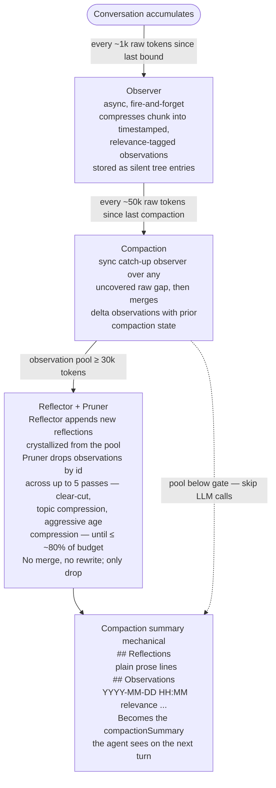

# pi-observational-memory

**Make Pi sessions feel endless.**

Every session has a cliff. You're three hours in, the context window fills up, compaction runs, and suddenly the agent doesn't remember what you decided in hour one. You start repeating yourself. The session that was flowing now feels like a new conversation with an amnesiac.

pi-observational-memory pushes that cliff out far enough that you stop thinking about it. It runs an **observer** continuously in the background while you work, summarizing the conversation in ~1k token chunks into a structured event log. When Pi compacts, the extension assembles that log — plus stable long-term **reflections** crystallized from it — into the compaction summary. The agent carries forward *what* you decided, *when*, *why*, and what's already done. Not as prose that degrades with each compaction cycle, but as structured memory that stays sharp.

```
## Reflections
User works at Acme Corp building Acme Dashboard on Next.js 15 with Supabase auth.
Hard constraint: ship by January 22nd 2026.
Public API uses GraphQL (switched from REST to reduce mobile over-fetching).

## Observations
2026-01-15 14:30 [high] User decided to switch from REST to GraphQL for the public API; motivation was reducing over-fetching on mobile clients.
2026-01-15 14:35 [medium] Agent scaffolded GraphQL schema in src/schema.ts.
2026-01-15 14:50 [medium] GraphQL migration completed; user confirmed queries working.
2026-01-15 15:10 [critical] User wants rate limiting on all public endpoints; prefers token bucket algorithm at 100 req/min per API key.
```

Observations carry a per-entry relevance tier (`low` / `medium` / `high` / `critical`) that drives pruning. Reflections are plain prose without timestamps — each one names a durable pattern, not a specific event.

Hour six should feel like hour one. The agent knows who you are, what you've built together, and what's left to do.

Pi's built-in compaction handles most sessions well — it tracks file operations, manages split turns, and keeps recent messages intact. This extension is for the sessions where "most" isn't enough: long builds, multi-feature sprints, and the kind of deep work where breaking flow to start a new session costs you more than the tokens.

Inspired by [Mastra's Observational Memory](https://mastra.ai/blog/observational-memory) research (94.87% on LongMemEval). This is an independent implementation built for Pi's extension system and compaction model.

## Why this matters

Pi's default compaction summarizes old messages into prose and tracks which files were read and modified. This works well for short-to-medium sessions. But prose summaries are inherently lossy in ways that compound over time — the third compaction summarizes a summary of a summary, and specific decisions, timestamps, and completion states get flattened.

Observational memory uses a different format that's designed to survive repeated compaction cycles:

| What you get | Why it matters |
|---|---|
| Per-minute timestamps | Temporal reasoning — agent knows *when* things happened |
| Continuous incremental summarization | Observations are written near-real-time, not all at once at compaction |
| Relevance tiers | Each observation is tagged `low` / `medium` / `high` / `critical`; the pruner keeps load-bearing entries and drops trivia |
| Reflections tier | Identity, decisions, and constraints crystallize and persist across compactions |
| Pruner pass | Multi-pass id-based drops remove outdated observations; reflections and user assertions survive |
| Mechanical summary assembly | The compaction summary is a deterministic concatenation, not an LLM rewrite — no compounding paraphrase loss |
| User assertions preserved | Statements about you ("I work at Acme") survive compression and aren't invalidated by later questions |
| Strict prose format | No emoji noise, no tag drift across model versions — just timestamped text |

## How it works

Three independent tiers, two of them mostly asynchronous:



**Observer** is async and runs in the background as turns complete — the user never waits on it. **Compaction** is synchronous and owned by the extension; when the working observation pool is small, no reflector/pruner LLM call runs at all (compaction is then 0 LLM calls). When it's above the gate, the reflector and pruner run as an inseparable pair — pruning is the consequence of reflection, not a separate cleanup step.

The actor LLM sees the latest compaction summary as a normal `compactionSummary` message — observations and reflections are never injected into the live message stream. This is a deliberate cache-friendliness choice: the conversation prefix stays stable until the next compaction, so prefix caching keeps working between turns.

For the full technical breakdown — entry shapes, async-race handling, summary assembly, configuration interactions — see **[docs/how-it-works.md](docs/how-it-works.md)**.

## Install

```bash
pi install npm:pi-observational-memory
```

Or from GitHub:

```bash
pi install git:github.com/elpapi42/pi-observational-memory
```

That's it. The extension hooks into Pi's lifecycle automatically. No config file needed to start — defaults work well for most sessions.

## Configuration

### Extension settings

Settings live under the `observational-memory` key in Pi's `settings.json` — globally at `~/.pi/agent/settings.json`, or per-project at `.pi/settings.json`. Project values override global.

```json
{
  "observational-memory": {
    "observationThresholdTokens": 1000,
    "compactionThresholdTokens": 50000,
    "reflectionThresholdTokens": 30000
  }
}
```

| Setting | Default | What it controls |
|---|---|---|
| `observationThresholdTokens` | `1,000` | Raw conversation tokens accumulated since the last observation or compaction before the observer fires asynchronously |
| `compactionThresholdTokens` | `50,000` | Raw conversation tokens accumulated since the last compaction before the extension triggers compaction via `ctx.compact()` |
| `reflectionThresholdTokens` | `30,000` | Working observation pool token size at which the reflector + pruner pair runs inside compaction (below this, both are skipped) |
| `compactionModel` | session model | Optional — use a cheaper model for observer/reflector/pruner passes |

> Upgrading from `pi-observational-memory@1.x`? The config keys changed: v1's `observationThreshold` is now `compactionThresholdTokens`, v1's `reflectionThreshold` is now `reflectionThresholdTokens`, and `observationThresholdTokens` is new. Old v1 keys are silently ignored — update your `settings.json`.

### Using a cheaper model for compaction

The observer, reflector, and pruner don't need the same capabilities as your coding agent. Offload them to something fast and cheap:

```json
{
  "observational-memory": {
    "compactionModel": { "provider": "openrouter", "id": "google/gemma-4-31b-it" }
  }
}
```

The same model is used for all three roles.

### Pi compaction settings

The extension works alongside Pi's built-in compaction settings in the same `settings.json`:

```json
{
  "compaction": {
    "keepRecentTokens": 20000
  }
}
```

| Setting | Default | What it controls |
|---|---|---|
| `keepRecentTokens` | `20,000` | Tokens of recent conversation kept verbatim (not summarized) |
| `reserveTokens` | `16,384` | Headroom for LLM response; Pi auto-compacts when context exceeds `window - reserveTokens` |

**How they interact:** Pi decides *when* to keep messages raw and *when* to auto-compact under window pressure. The extension decides *how* to compact (mechanical concatenation of reflections + observations instead of a flat LLM-written summary) and *when to proactively trigger* compaction before the window fills. Both paths end up at the same `session_before_compact` hook.

## Commands

| Command | Description |
|---|---|
| `/om-status` | Memory totals (reflections, committed vs pending observations, relevance histogram) plus activity counters: tokens since last bound / last compaction / current observation pool, percent-to-threshold for each gate, and in-flight flags for the observer and compaction |
| `/om-view` | Full dump of memory state: reflections, committed observations (folded into the last compaction), and pending observations (recorded since). Each observation line is `[id] YYYY-MM-DD HH:MM [relevance] content`. |

## Design decisions

**Why three tiers instead of two.** Observer, reflector, and pruner are separated by cadence: observation runs continuously (and cheaply) so the working set is always fresh; reflection and pruning run only at compaction time and only when there's enough material to crystallize. This keeps per-turn latency low and makes compaction itself usually a no-LLM operation.

**Why the summary is mechanical.** Each compaction summary is a deterministic concatenation of `details.reflections` + `details.observations`, never an LLM rewrite. This eliminates the compounding-paraphrase problem of nested summaries — what survives one compaction survives all subsequent ones verbatim, until the pruner explicitly drops it by id. The pruner cannot rewrite observations, which is what makes this property hold.

**Why reflector and pruner always run together.** Pruning is only safe once the long-lived facts in the observation pool have been crystallized into reflections. Running pruner without reflector would lose information; running reflector without pruner would let the observation pool grow forever. They share a single gate (`reflectionThresholdTokens`) and either both run or neither does.

**Why the actor doesn't see live observations.** Injecting fresh observations into every turn would invalidate prefix caching with each new entry — every turn would be a cold cache for the prompt. By keeping observations out of the live message stream and only surfacing them through the next compaction summary, the prefix stays stable between compactions and caching keeps working.

**Why memory lives in the session tree.** State is stored in Pi's session entries — `om.observation` custom entries for the delta and `compaction.details` for the cumulative reflection + observation set. No external database, no filesystem state, no separate sync. The Pi tree is the only source of truth; closure state is just a handful of concurrency flags (observer in-flight, compaction trigger in-flight, compaction hook in-flight) and a promise handle for awaiting an in-flight observer. If you `/tree` to a branch, each branch carries its own memory state through `compaction.details`.

## License

MIT
