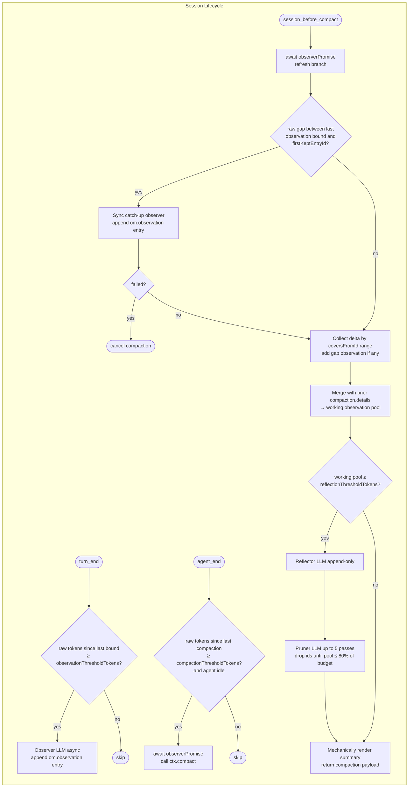

# How Observational Memory Works

## The Problem

Pi agents lose context when the conversation grows beyond the model's context window. Pi handles this through **compaction** — summarizing older messages so recent ones fit. The default compaction produces a flat LLM-written summary that loses structure, priority, and temporal ordering. Worse, each subsequent compaction summarizes a summary of a summary, and specific decisions, timestamps, and completion states get flattened with each cycle.

This extension replaces the LLM-written summary with a structured, mostly-asynchronous memory system. The compaction summary becomes a deterministic concatenation of two pools — **reflections** (stable long-lived facts) and **observations** (timestamped events) — both produced incrementally as the session progresses.

## The Solution: Three Tiers, Mostly Async



The actor LLM only ever sees the most recent compaction summary as a normal `compactionSummary` message. Observations and reflections are never injected into the live message stream. The conversation prefix stays stable between compactions, which preserves prefix caching.

## The Three Tiers

### 1. Observer (continuous, async)

Fires on `turn_end`. Cheap. Runs in the background.

After each agent turn, the extension walks the current branch and counts raw tokens since the **last bound** — defined as the more recent of the last `om.observation` tree entry or the last `compaction` entry. When this exceeds `observationThresholdTokens` (default 1000), an observer LLM call fires asynchronously.

The observer receives:
- All current reflections from the most recent compaction's `details` (committed reflections).
- All current observations: the committed observations in the most recent compaction's `details`, plus every pending `om.observation` appended since (each already-recorded observation is shown to the observer as `[id] YYYY-MM-DD HH:MM [relevance] content`, so the model can deduplicate).
- The new chunk of raw conversation (filtered to message entries between the last bound and the current leaf, with inline `[Role @ timestamp]:` headers).
- A current local time fallback for observations that don't have an obvious message timestamp.

The observer uses a `record_observations` tool it may call multiple times as it works through the chunk. Each observation has four fields: `timestamp` (`YYYY-MM-DD HH:MM`), `content` (single-line plain prose), and `relevance` (one of `low`, `medium`, `high`, `critical`). An `id` is computed as the first 12 hex chars of a SHA-256 over the content — duplicates within a run collapse automatically.

The full batch is written to the tree as one `om.observation` `custom` entry with `{ records: ObservationRecord[], coversFromId, coversUpToId, tokenCount }`. `coversFromId` is the first raw entry id after the last bound at trigger time; `coversUpToId` is the leaf at trigger time. Together these form a range the next compaction uses to decide which observations are in its delta.

Observer is fire-and-forget. The user never waits on it. A concurrency flag (`observerInFlight`) plus a shared `observerPromise` prevent two observers from racing — if a turn ends while one is still running, the new trigger is skipped and the next turn picks up the accumulated tokens. The compaction trigger and hook both `await observerPromise` before doing any work, so nothing observable can be in flight when the tree walk for a compaction runs.

### 2. Compaction Trigger (every ~50k raw tokens)

Fires on `agent_end`. Synchronous intent, deferred via `setTimeout(0)` so `ctx.compact()` runs outside the agent loop (mid-loop compaction is unsafe in Pi).

The extension recomputes raw tokens since the most recent `compaction` entry on the branch. If it exceeds `compactionThresholdTokens` (default 50000) and the agent is idle, `ctx.compact()` is called. This kicks off Pi's compaction flow, which then fires the `session_before_compact` event.

### 3. Compaction Assembly (`session_before_compact`)

This is where the summary is built. The extension owns this hook entirely — Pi's default LLM summarizer is bypassed. A `compactHookInFlight` flag cancels any duplicate re-entry into the hook.

1. **Await in-flight observer.** If an async observer is still running, the hook waits for it (`await observerPromise`) and refreshes the branch from the session manager so any newly-appended `om.observation` entry is visible to the rest of the hook.

2. **Sync catch-up observer (gap coverage).** Because `keepRecentTokens` can leave raw entries between the last observation bound and the new `firstKeptEntryId` — entries that are about to be pruned from the raw log — the hook serializes that gap range and runs the observer synchronously over it. If it produces observations, they're appended as an `om.observation` entry immediately and added to the delta collected in the next step. If the gap observer fails, the hook **cancels the compaction** (proceeding would silently erase the gap), surfaces the reason to the UI, and asks the user to retry `/compact`.

3. **Collect the delta.** `collectObservationsByCoverage` returns every `om.observation` whose `coversFromId` falls in the range `[priorFirstKeptEntryId, newFirstKeptEntryId)`. Using `coversFromId` (not tree position) is what makes the walk precise: an observation whose chunk straddled the new `firstKeptEntryId` is *not* included — it'll be collected by the next compaction when its `coversFromId` finally falls inside that cycle's range. The just-appended gap observation is concatenated into the delta here. If the final delta is empty, the hook cancels the compaction (nothing to add on top of the prior state).

4. **Merge with prior state.** The cumulative state lives in `compaction.details = { type: "observational-memory", version: 3, reflections: [], observations: [] }`. Reflections are carried forward. Committed observations (from the prior `details.observations`) are unioned with delta observation records to form the working observation pool.

5. **Gate the reflector + pruner.** If the working observation pool exceeds `reflectionThresholdTokens` (default 30000), run two LLM agents as an inseparable pair:
   - **Reflector.** Calls `record_reflections` (append-only) one or more times to add new reflection lines crystallized from the working pool. Never modifies or removes existing reflections. Duplicates against both `reflections` and within-run adds are silently discarded.
   - **Pruner.** Calls `drop_observations` with ids to remove. Runs up to 5 passes with a per-pass strategy tier (1 = clear-cut duplicates and superseded entries; 2 = topic compression — drop lows covered by recent highs, and mediums covered by reflections; 3+ = aggressive age compression of the older half). Each pass targets `0.8 * reflectionThresholdTokens`; passes stop early when the pool fits, when a pass returns zero drops, or on LLM failure (in which case the last good kept set is retained). The pruner *cannot* merge, rewrite, or add observations — only drop by id, which keeps kept content byte-identical to what the observer originally wrote.

   Below the gate, both calls are skipped and the working sets carry through unchanged. This means compaction is **0 LLM calls** in early sessions, **1 LLM call** when only a gap observer fires, and **≥2 LLM calls** (reflector + one-or-more pruner passes) in steady state.

6. **Render the summary.** Mechanical concatenation:
   ```
   <CONTEXT_USAGE_INSTRUCTIONS preamble>

   ## Reflections
   <reflection line>
   <reflection line>

   ## Observations
   YYYY-MM-DD HH:MM [relevance] ...
   YYYY-MM-DD HH:MM [relevance] ...
   ```
   No LLM is involved at this step. Sections are omitted if empty.

7. **Return to Pi.** The hook returns `{ compaction: { summary, firstKeptEntryId, tokensBefore, details } }`. Pi appends a `compaction` entry with these fields. The summary becomes a `compactionSummary` message in the next turn's context; `details` becomes the cumulative state read by the next compaction.

## Content Format

Observations and reflections share a strict "single-line plain prose" rule, but their surrounding fields differ:

**Observation** — structured record with separate fields; rendered as `YYYY-MM-DD HH:MM [relevance] content`:

```
ObservationRecord = {
  id: string           // 12-char hex of SHA-256(content)
  timestamp: string    // "YYYY-MM-DD HH:MM" local, 24h, to the minute
  content: string      // single-line plain prose
  relevance: "low" | "medium" | "high" | "critical"
}
```

Example: `2026-01-15 14:50 [medium] GraphQL migration completed; user confirmed queries working.`

**Reflection** — just a string of plain prose. No timestamp, no relevance tag, no prefix of any kind. A reflection names a durable pattern, not a specific event, so temporal metadata would be misleading.

Example: `User works at Acme Corp building Acme Dashboard on Next.js 15.`

The `content` string in both is strictly plain prose — no emojis, no priority markers, no `[tags]`, no Markdown bullets, no code fences, no embedded structured fields. Timestamp and relevance live in dedicated fields rather than inside the content so the record survives pruner round-trips verbatim.

This strictness exists for three reasons:
1. The pruner must emit ids only, which means kept observations retain their original content, timestamp, and relevance byte-identically. Storing those as fields (rather than as prefixes to be re-parsed) is what guarantees this.
2. The summary renderer is mechanical — formatting drift in any single entry would visibly leak into the actor's context.
3. Emoji and tag conventions drift across model versions; plain prose is stable.

Observation content is also capped at 10,000 characters; longer strings are truncated with a ` … [truncated N chars]` tail to keep the pool bounded even if the observer misbehaves.

### Relevance tiers

Relevance is assigned by the observer and used by the pruner to decide drop priority:

- **critical** — user identity, explicit corrections, concrete completions. Never dropped, regardless of age or budget pressure.
- **high** — non-trivial technical decisions, architectural direction, unresolved blockers, key constraints. Dropped only when clearly superseded or covered by an existing reflection.
- **medium** — task-level context. The default when the observer isn't sure whether a fact is durable.
- **low** — routine tool-call acks, repetitive status updates, content re-derivable from recent messages. Dropped first under pressure.

The pruner also honours a content-level floor: user assertions and concrete completion markers are never dropped even when tagged `low`, and any observation carrying a unique named identifier, dated event, verbatim error, or rationale for a decision is kept unless an existing reflection already captures the same information.

## State Persistence

The Pi session tree is the only source of truth. There is no external database, no on-disk sidecar, no closure cache that needs rebuilding.

Two entry types carry state:

- **`om.observation`** (`custom` entry, `customType: "om.observation"`) — written by the observer. Holds `{ records: ObservationRecord[], coversFromId, coversUpToId, tokenCount }` in `data`. Append-only. Used by the next compaction's coverage-based walk.
- **`compaction.details`** (typed payload on the `compaction` entry) — holds `{ type: "observational-memory", version: 3, observations: ObservationRecord[], reflections: Reflection[] }`. Cumulative branch-local state. Each new compaction reads the most recent prior `details` (the "committed" pool) and writes its own.

Committed vs pending. `getMemoryState(branch)` returns three things derived from the entries:
- `reflections` — from the most recent `compaction.details.reflections`.
- `committedObs` — from the most recent `compaction.details.observations` (observations folded into the last compaction).
- `pendingObs` — all records in `om.observation` entries whose `coversFromId` falls at or after the prior compaction's `firstKeptEntryId` (observations recorded since the last compaction — waiting for the next one).

Both `/om-status` and `/om-view` use this split; compaction assembly uses essentially the same partition but via `collectObservationsByCoverage` so it can also exclude any pending observation whose chunk straddles the upcoming `firstKeptEntryId` (those are deferred to the next cycle).

In-memory closure state is minimal: the loaded config and a small set of concurrency handles — `observerInFlight`, `observerPromise` (for awaiting a live observer), `compactInFlight` (trigger side), `compactHookInFlight` (hook side, cancels duplicate re-entry), and `resolveFailureNotified` (so a missing API key is only warned about once). Token counters (raw tokens since last bound, raw tokens since last compaction) are recomputed on every check from a branch walk — there is no incremental cache to invalidate.

This means session resume, branch switching, and tree navigation are all transparent — there is no state to rebuild, because there is no cached state.

## Async Race Handling

The observer is fire-and-forget, so observations can land at awkward moments relative to compaction. The extension handles this with three cooperating mechanisms:

1. **`observerInFlight` + `observerPromise`** — the observer is guarded by a flag and exposes a promise handle. If a `turn_end` fires while one is running, the new trigger is skipped; the accumulated raw tokens just get picked up by the next trigger after the in-flight observer completes. No data is lost; observations batch together.

2. **Compaction trigger awaits the observer.** When raw tokens since the last compaction cross `compactionThresholdTokens`, the trigger `setTimeout(0)`s a task that first awaits `observerPromise`, then re-checks `ctx.isIdle()` and the token count (another compaction may have happened during the wait), and only then calls `ctx.compact()`. This means `ctx.compact()` is never called with an observer still writing to the tree.

3. **`session_before_compact` awaits again and refreshes the branch.** A belt-and-braces re-await in the hook catches the case where an observer fired between the trigger's await and the hook running (e.g., a user-initiated `/compact`). After awaiting, the hook re-reads `ctx.sessionManager.getBranch()` so any just-appended `om.observation` entry is visible.

After those awaits, one last source of uncovered raw tokens remains: the `keepRecentTokens` window may have advanced *past* the last observation bound, leaving a gap of raw entries between the last `coversUpToId` and the new `firstKeptEntryId`. The sync catch-up observer closes that gap. Failure of this step cancels the compaction rather than silently losing information — the next `/compact` (or next trigger) will retry.

Delta collection is coverage-based (`coversFromId` inside `[priorFirstKeptEntryId, newFirstKeptEntryId)`), not tree-position-based. This matters specifically when a pending observation's chunk straddles the upcoming `firstKeptEntryId`: the whole observation is deferred to the next compaction cycle (when its `coversFromId` will fall inside that cycle's range) rather than being half-counted in this one.

There is no separate reflection race: reflector and pruner run synchronously inside `session_before_compact`, on whatever data the branch holds at that moment, and the `compactHookInFlight` flag cancels any duplicate hook re-entry.

## Cache-Friendliness

A deliberate design constraint: the actor LLM's prompt prefix should stay stable between compactions. If we injected fresh observations into every turn (e.g., as a system-prompt suffix or a tail message), each new observation would invalidate the prefix cache and every turn would pay a cold-cache cost.

Instead, observations live in silent tree entries that the actor never sees. Reflections live inside `compaction.details`. Both surface to the actor only at the next compaction, packaged into the new `compactionSummary` message — at which point the prefix shifts exactly once and then stays stable until the next compaction.

This is the central trade-off versus a "live memory injection" design: the actor sees memory updates only at compaction boundaries, but caching keeps working between them.

## Configuration

Observational memory's behavior is shaped by settings in Pi's `settings.json` (globally at `~/.pi/agent/settings.json`, or per-project at `.pi/settings.json`; project values override global). Two namespaces are involved: the extension's own keys under `observational-memory`, and two of Pi's built-in `compaction` keys — `keepRecentTokens` (structural to how the extension works) and `reserveTokens` (the safety-net trigger).

```json
{
  "observational-memory": {
    "observationThresholdTokens": 1000,
    "compactionThresholdTokens": 50000,
    "reflectionThresholdTokens": 30000
  },
  "compaction": {
    "enabled": true,
    "keepRecentTokens": 20000,
    "reserveTokens": 16384
  }
}
```

The five settings below are listed in roughly the order they affect a session's life: the observer fires first and often, the extension-trigger cadence comes next, the reflector + pruner gate engages inside compaction, the model choice applies to all three roles, and the Pi-owned compaction settings determine what each compaction actually does to the raw log.

### `observationThresholdTokens` — default `1,000`

Raw conversation tokens accumulated since the last `om.observation` or `compaction` entry (whichever is more recent) before the observer fires asynchronously on `turn_end`. This is also roughly the chunk size each observer call digests — the observer receives the raw text between the last bound and the current leaf.

**Effect on behavior.** Lower values produce finer-grained observations and more frequent background LLM calls (higher cost, lower per-call latency). Higher values produce coarser, denser observations at lower cost — but also leave longer stretches of raw conversation with no running summary, which shifts work onto the sync catch-up observer at compaction time. If the observer is already in flight when a new `turn_end` crosses the threshold, the trigger is skipped and tokens accumulate until the next turn.

### `compactionThresholdTokens` — default `50,000`

Raw conversation tokens accumulated since the last `compaction` entry before the extension proactively calls `ctx.compact()` on `agent_end`. The trigger defers through `setTimeout(0)`, awaits any in-flight observer, re-checks `ctx.isIdle()` and the token count, and only then calls `ctx.compact()`.

**Effect on behavior.** Lower values compact more often — more frequent opportunities for the reflector + pruner to crystallize patterns and clean up the pool, but more LLM cost over a session, and more `firstKeptEntryId` churn if the raw tail is short. Higher values let observations accumulate longer; if Pi's auto-compaction (governed by `reserveTokens`) fires first under window pressure, the extension's `session_before_compact` hook still runs the same way, so this threshold is really about *proactive* compaction before window pressure hits.

### `reflectionThresholdTokens` — default `30,000`

Working observation pool token size at which the reflector + pruner pair engages inside a compaction. "Working pool" here means `committedObservations + deltaObservations + gapObservation`, measured at hook-entry time.

**Effect on behavior.** Below this gate, the reflector and pruner are both skipped and the working pool is written to the new `compaction.details` unchanged — compaction is **0 LLM calls** (or 1 if the sync catch-up observer ran). At or above the gate, the reflector appends new reflections (never rewrites existing ones) and the pruner runs up to 5 id-based drop passes until the pool fits under `0.8 * reflectionThresholdTokens` — compaction is **≥2 LLM calls**. Lower values crystallize reflections earlier and keep the observation pool tight at the cost of more frequent reflector+pruner runs; higher values let the pool grow before cleanup, making individual compactions cheaper but growing the summary size between cleanups.

### `compactionModel` — default: session model

Optional `{ "provider": "...", "id": "..." }` override for the observer, reflector, and pruner. All three background roles share this setting.

**Effect on behavior.** Setting this to a smaller, faster, or cheaper model lets you offload background memory work without changing the main coding agent's model. These roles are structurally simpler than general coding — the observer summarizes fixed chunks, the reflector distills patterns, the pruner drops ids — so a smaller model is usually appropriate. If the configured model is not found in the registry the extension falls back to the session model (with a warning); if no API key is available for the chosen model the observer is skipped (warning once) and the compaction hook cancels the compaction (surfacing a clear error) rather than silently falling back.

### `keepRecentTokens` — Pi setting under `compaction`; default `20,000`

Tokens of recent conversation Pi keeps **verbatim** during compaction — the raw tail that is *not* replaced by the compaction summary. This defines the `firstKeptEntryId` cutoff Pi passes to `session_before_compact`.

This setting is **structural** to the extension, not merely a tuning knob — it sits at the same level as the three extension thresholds because three of the extension's core behaviors are direct consequences of it:

- **Sync catch-up gap size.** The extension runs a synchronous observer pass over the range `[lastObservationBound, firstKeptEntryId)` at compaction time to cover any raw entries the async observer hasn't yet summarized. If `keepRecentTokens` is small, `firstKeptEntryId` advances further forward and the gap shrinks (even becomes empty); if it's large, the gap can be substantial and the sync catch-up pass does real work.
- **Pending observation deferral.** Pending observations whose `coversFromId` falls inside the kept tail (at or after `firstKeptEntryId`) are deferred to the next compaction cycle — their raw source is still live, so they'll be collected next time their coverage falls into the pre-tail range. Larger `keepRecentTokens` means more deferrals; smaller means fewer.
- **Raw tail the agent still sees.** After compaction, the actor sees the compaction summary *plus* the raw tail between `firstKeptEntryId` and the leaf. Higher `keepRecentTokens` preserves more literal conversation; lower forces more continuity through observations and reflections.

**Effect on behavior.** Higher values leave more conversation verbatim post-compaction — good for short-horizon recall, but less room in context for the summary and potentially more deferred observations. Lower values compress more aggressively, reduce the sync-catch-up workload, and rely more heavily on observations + reflections to carry context across the compaction boundary.

### `reserveTokens` — Pi setting under `compaction`; default `16,384`

Tokens Pi reserves for the LLM response. Pi auto-compacts when the context exceeds `contextWindow − reserveTokens`.

**Effect on behavior.** For the extension, this is the safety net. If the extension's own `compactionThresholdTokens` hasn't been crossed yet when window pressure hits, Pi will force compaction anyway, and the extension's `session_before_compact` hook runs just the same. Raising `reserveTokens` makes Pi compact earlier (more conservative); lowering it gives the extension's proactive trigger more runway before Pi's safety net kicks in.

### `compaction.enabled` — Pi setting; default `true`

Whether Pi's auto-compaction triggers at all. Manual `/compact` and the extension's own trigger still work when this is `false`, but Pi's window-pressure safety net does not — so setting this to `false` means you rely entirely on the extension's threshold (and manual compactions) to keep the context bounded.

### How Pi and the extension cooperate

Pi's auto-compaction and the extension's own trigger are independent paths into the same hook. There are three ways compaction can start:

1. **Extension trigger** — raw tokens since the last compaction exceed `compactionThresholdTokens`, the agent is idle, and no observer is in flight.
2. **Pi auto-compaction** — context approaches `contextWindow − reserveTokens` (safety net).
3. **Manual `/compact`** — user-triggered.

In all three cases Pi fires `session_before_compact`, and the extension's hook fully replaces Pi's default LLM summarizer — no code path uses Pi's prose summarizer when this extension is installed.

The split of responsibilities:

- **Pi decides** the `firstKeptEntryId` cutoff via `keepRecentTokens` and the safety-net trigger via `reserveTokens`.
- **The extension decides** how often the observer fires (`observationThresholdTokens`), when to proactively compact (`compactionThresholdTokens`), when the reflector + pruner pair engages (`reflectionThresholdTokens`), and what model runs the three background roles (`compactionModel`).

